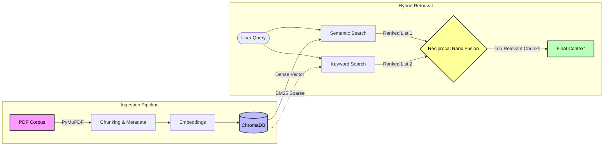
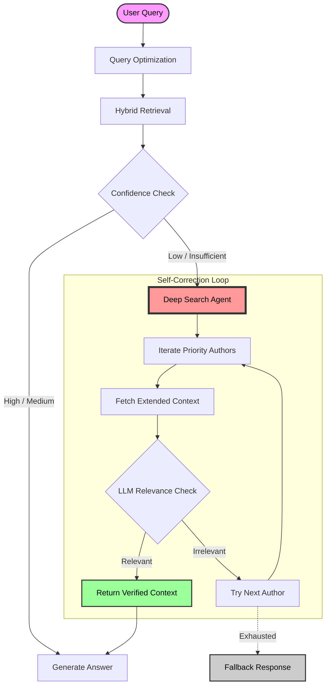

# Probability Academic RAG Chatbot

### PDF Ingestion → Hybrid Retrieval → Deep Search Verification → Answer Generation

A production-ready RAG system that transforms static academic bibliography into an interactive study assistant, enabling students to query textbooks and lecture notes with citation-backed accuracy.

**Tech Stack**: Python · LangChain · Google Gemini · ChromaDB · Sentence-Transformers · PyMuPDF · Streamlit · RRF (Reciprocal Rank Fusion)

---

## Motivation

Students of advanced mathematics face unique challenges when navigating course materials:

- **Information Overload**: Searching for specific theorems or proofs across multiple 500-page PDFs is time-consuming.
- **Conceptual Gaps**: Keyword search fails when students can describe a concept but don't recall its exact name.
- **Generic AI Limitations**: Standard LLMs often hallucinate mathematical proofs or provide explanations that drift from the specific course curriculum.
- **Trust Requirements**: Mathematical answers must be verifiable; "trust me, bro" is not acceptable in academia.

---

## Problem Statement

Given a corpus of unstructured academic documents (Textbooks, Lecture Notes, Exercises):

1. **Ingest** and structure content while preserving mathematical notation (LaTeX).
2. **Retrieve** relevant context using hybrid search strategies (Dense Vectors + Sparse Keywords).
3. **Verify** relevance using an agentic "Deep Search" loop to filter out false positives.
4. **Generate** pedagogical answers that cite specific authors, pages, and chapters.

---

## System Architecture & Workflow

### 1. Ingestion & Retrieval Pipeline



### 2. CRAG (Corrective RAG) & Deep Search Logic

The system implements an **agentic loop** to handle hard queries where standard retrieval fails (e.g., finding a specific proof in a 500-page book).



---

## Interactive Showcase (Streamlit)

The application provides a clean, research-focused interface:

- **Confidence Badges**: Visual indicators (High/Medium/Low) of answer reliability.
- **Source Transparency**: Expandable "Sources Consulted" panel showing the exact text snippets used.
- **Math Rendering**: Full LaTeX support for equations and formulas.
- **Search Filters**: Drill down by specific authors (e.g., "Only search Ferrari's notes").

---

## Project Structure

```text
academic-rag-chatbot/
├── app.py                     # Streamlit application entry point
├── ingest.py                  # CLI script for processing PDFs
├── requirements.txt           # Python dependencies
├── .env.example               # Configuration template
├── README.md                  # Project documentation
│
├── src/                       # Core Logic
│   ├── ingestion/             # PDF processing & Indexing
│   │   ├── pdf_extractor.py
│   │   ├── chunker.py
│   │   └── indexer.py
│   ├── retrieval/             # Search Algorithms
│   │   ├── retriever.py       # Hybrid Search & RRF
│   │   ├── confidence.py      # Confidence scoring engine
│   │   └── query_processor.py # Deep Search & Query Expansion
│   ├── generation/            # LLM Interaction
│   │   ├── llm_client.py
│   │   └── prompts.py
│   └── utils/                 # Helpers
│       └── config.py
│
├── data/                      # Data persistence
│   ├── raw/                   # Input PDFs
│   └── processed/             # Sparse Index (BM25)
│
└── chroma_db/                 # Vector Database
```

---

## How to Run Locally

```bash
# Clone the repository
git clone https://github.com/ssantioviedo/Probability-Academic-RAG-Chatbot
cd Probability-Academic-RAG-Chatbot

# Install dependencies
python -m venv venv
# Activate venv (Windows: venv\Scripts\activate, Mac/Linux: source venv/bin/activate)
pip install -r requirements.txt

# Configure Environment
cp .env.example .env
# Edit .env to add your GOOGLE_API_KEY

# Ingest Data (Place PDFs in data/raw first!)
python ingest.py --data-dir data/raw

# Launch App
streamlit run app.py
```

---

## What This Project Demonstrates

- **RAG Architecture**: End-to-end implementation of Retrieval-Augmented Generation.
- **Search Optimization**: Beyond simple vector search—implementing Hybrid Search, RRF, and Context Expansion.
- **Agentic Workflows**: Implementing self-correction loops ("Deep Search") to improved reliability.
- **Prompt Engineering**: Constraining LLMs to specific contexts and strict formatting rules.
- **Software Engineering**: Clean, modular code structure suitable for production maintenance.

---

## Author

**Santiago Oviedo** | *Data Scientist*

🔗 **LinkedIn**: [linkedin.com/in/ssantioviedo](https://linkedin.com/in/ssantioviedo)
